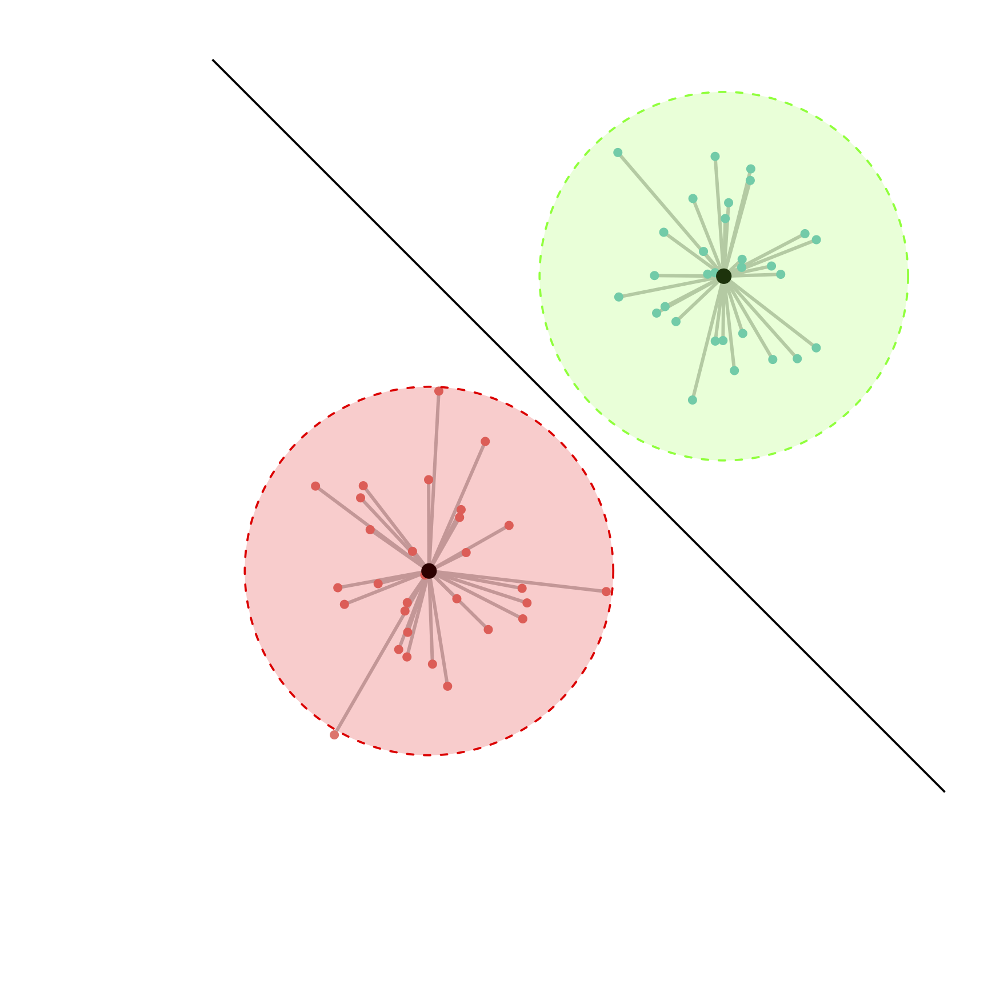
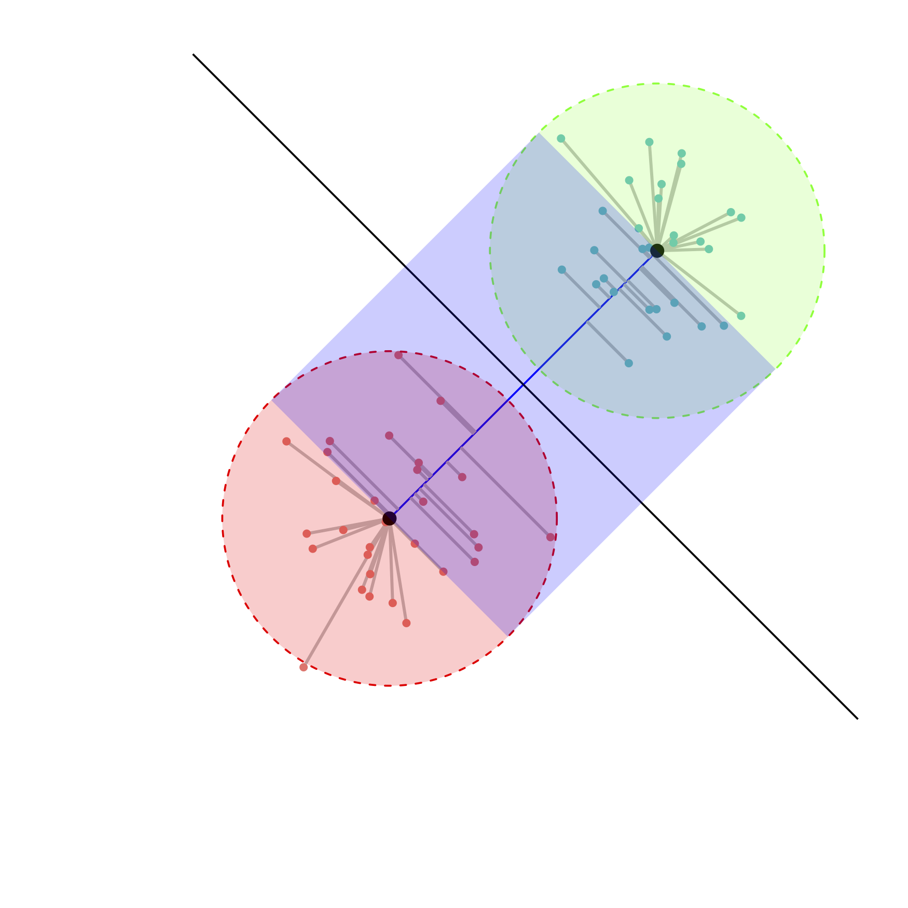

# spectralBridges Rpackage
 Spectral Bridges Clustering R package  implements a novel clustering algorithm combining k-means and spectral clustering techniques. It leverages efficient affinity matrix computation and merges clusters based on a connectivity measure inspired by SVM's margin concept. This package is designed to provide robust clustering solutions, particularly suited for large datasets. 

## Features

-   **Spectral Bridges Algorithm**: Integrates k-means and spectral clustering with efficient affinity matrix calculation for improved clustering results.
-   **Scalability**: Designed to handle large datasets by optimizing cluster formation through advanced affinity matrix computations.
-   **Customizable**: Parameters such as number of clusters, iterations, and random state allow flexibility in clustering configurations.

## Installation

To install the package 

```{r}
devtools::install_github("https://github.com/cambroise/spectral-bridges-Rpackage/")
library(spectralBridges)
```

## Usage

```{r}
X<-iris[,1:4] # Data to cluster
True_classes<-iris$Species
res<-spectral_bridges(X,n_cells=12,n_classes=3) # Partition in 3 classes
table(True_classes,Est_classes=res$clustering)  
```


## Documentation and help

For detailed documentation, please refer to the package vignette:
```{r}
vignette("spectral_bridges_vignette")
help(spectral_bridges)
```

## Python version

Spectral Bridges Clustering algorithm is also available in python <https://pypi.org/project/spectral-bridges/>


## Principles

The proposed algorithm uses k-means centroids for vector quantization defining Voronoi region, and a strategy is proposed to link these regions, with an "affinity" gauged in terms of minimal margin between pairs of classes. These affinities are considered as weight of edges defining a completely connected graph whose vertices are the regions. Spectral clustering on the region provide a partition of the input space. The sole parameters of the algorithm are the number of Voronoi region and the number of final cluster. 

### Bridge affinity 

The basic idea involves calculating the difference in inertia achieved by projecting onto a segment connecting two centroids, rather than using the two centroids separately (See Figure below). If the difference is small, it suggests a low density between the classes. Conversely, if this difference is large, it indicates that the two classes may reside within the same densely populated region.

<div style="width:1000px">
<figure class="left" style="float:left">
    
</figure>
<figure class="right" style="float:right">
    
</figure>
 <p>Balls (left) versus Bridge (right). The inertia of each structure is the sum of the squared distances represented by grey lines.</p>
</div>


